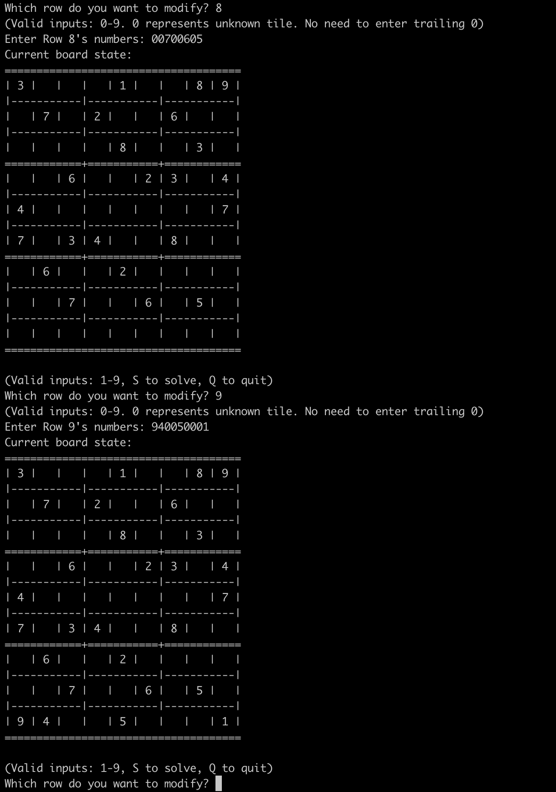
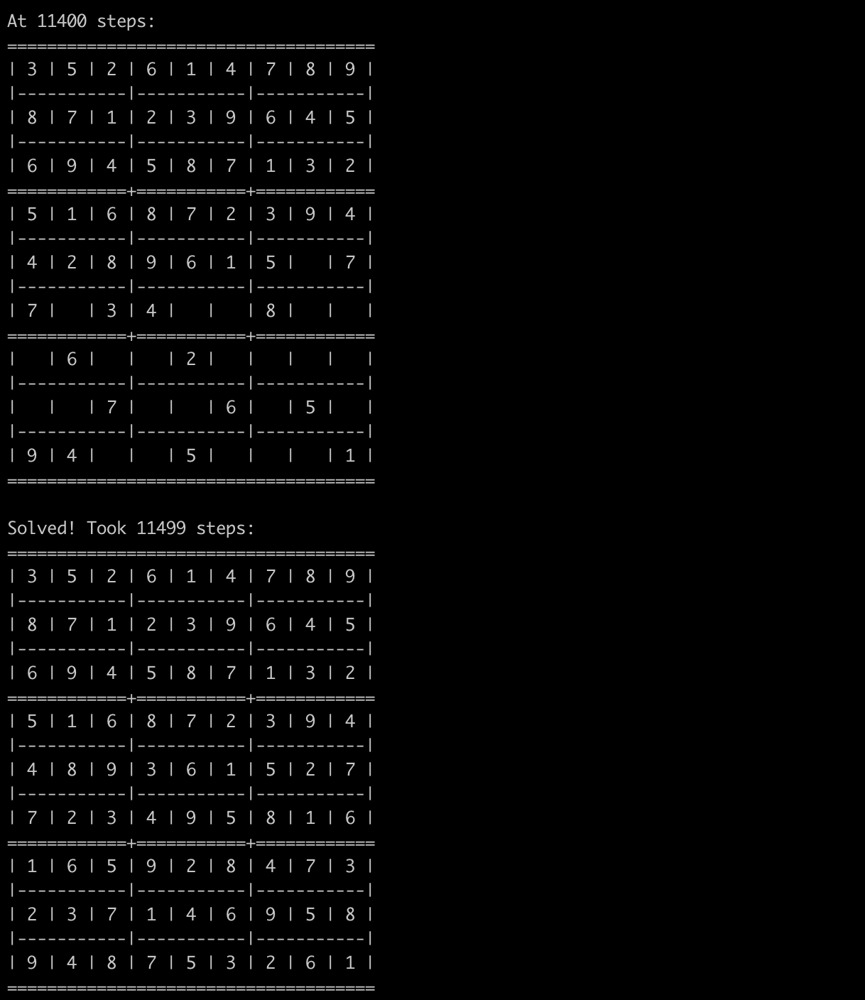

# Sudoku Solver (Apr. 2019)

This is a backtracking Sudoku Solver implemented in C

## Get Started
1) Clone/download the project
2) Navigate your terminal to the directory of this project
3) Type command `gcc board.c input.c solver.c main.c` to compile these code
4) Type command `./a.out` to run the solver!

## Control
The program will print out which control are valid and what they do

An example input to fill a row with number would be `001039` if 
- The third position contains a 1
- The fifth position contains a 3
- The sixth position contains a 9
- All other positions are blank

## Demo
### Input

### Solution!

